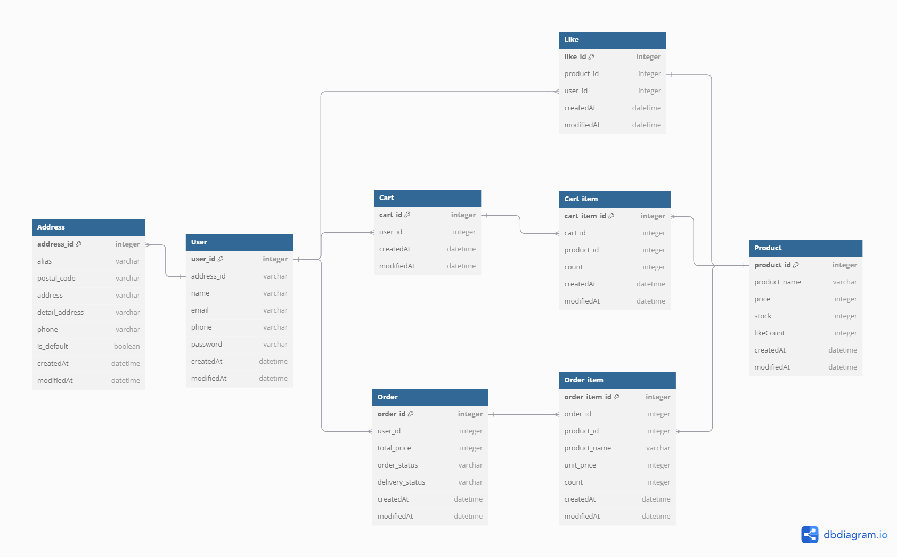
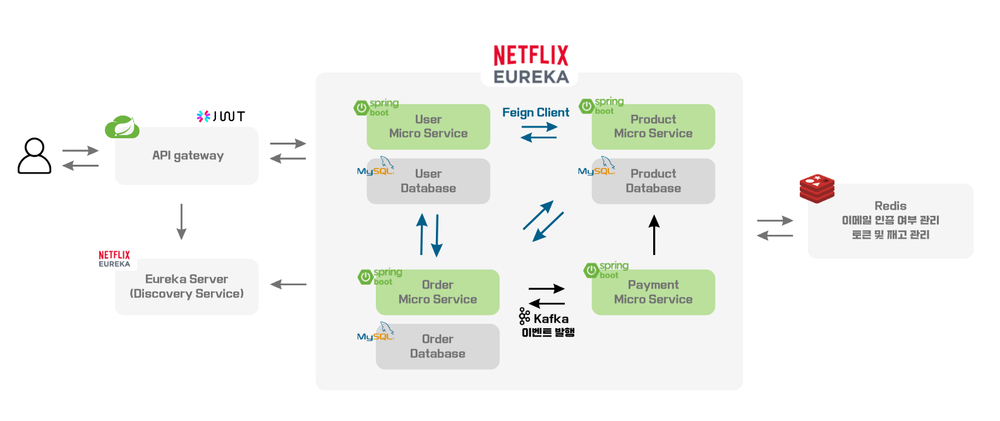

<!-- ABOUT THE PROJECT -->

##  E-commerce MSA Project

* **2024년 8월 ~ 2024년 9월 / 1인 프로젝트**

- 이 프로젝트는 **특정 시간대에 오픈된 선착순 상품 구매가 원활하게 이루어지도록 설계된 E-commerce 서비스** 입니다. 마이크로 서비스 아키텍처를 채택하여 각 서비스의 확장성과 독립성을 높였고, 동시성 문제와 대규모 트래픽을 효과적으로 처리하기 위한 기술적 고민과 선택이 반영되었습니다.

## Tech Stack

- **Backend**
	- Java : JDK 21
	-  Spring Boot : 3.3.2
	-  Spring Data JPA
	-  Spring Security
	-  Spring Cloud Netflix  Eureka
	-  Spring Cloud Gateway
	-  Spring Cloud OpenFeign
	-  JWT : 0.11.5

- **Storage**
	-   MySQL
	-   Redis : 3.1.2
- **Testing**
	- Junit5
	- Jmeter

##  System Design

### 1)  ER Diagram

### 2) Project Architecture

### 3) API documentation

- [API 문서 바로가기](https://documenter.getpostman.com/view/36704792/2sAXjRVpGJ)

### 4) Main Feature

1.  **회원 관리 및 인증/인가 프로세스**

	- 이메일 인증을 통한 회원가입
		- Redis의 해시 구조를 사용한 이메일 인증 코드 저장 및 관리
		- 만료 시간을 설정하여 3분 후 자동으로 만료

	- Spring Security Crypto Module을 이용한 회원 정보 암호화
		- PasswordEncoder를 사용한 비밀번호 암호화
		- AesBytesEncryptor를 사용한 개인정보 암호화

	- 인증/인가 프로세스
		- 로그인 시 JWT Access Token과 Refresh Token 발급
		- 만료된 Access Token은 Redis에 저장된 Refresh Token을 검증하여 재발급
		- API Gateway에서 토큰을 검증하고, Claim에 포함된 유저 정보를 헤더에 추가하여 서비스 이용

2.  **주문 및 재고 관리 프로세스**

	- 주문 처리
		- 주문 진행 시 Redis에서 재고 감소, 결제 처리 후 DB 재고 반영
		- 결제 실패 시(고객 이탈 및 결제사 오류 등으로 가정) Redis의 재고 복구

	- Redis를 활용한 재고 관리
		- 인메모리 데이터베이스 Redis를 사용하여 상품 재고 캐싱
		- Redisson Lock을 활용하여 동시성 문제 해결 및 데이터 일관성 유지

	-  스케줄러를 이용한 주문 및 배송 상태 변경 시나리오
		- 매일 자정 주문 상태 변경
		- 배송준비중 → 배송중 / 배송중 → 배송 완료 /반품진행중 → 반품 완료

	-  주문 취소 및 반품 시나리오
		- 배송 준비 중일 경우 주문 취소가 가능하며, 취소 후 즉시 재고 증가
		- 배송 완료 후 1일 이내 반품이 가능하며, 반품 신청 후 1일 뒤에 재고 증가

	- 그 외 구현 기능들
		- 장바구니 추가/삭제 및 수량 증감 기능
		- 카테고리 별 상품 목록 조회 및 상세 조회
		- 주문 상세 조회
		- 주문 취소 및 반품

## Trouble Shooting
